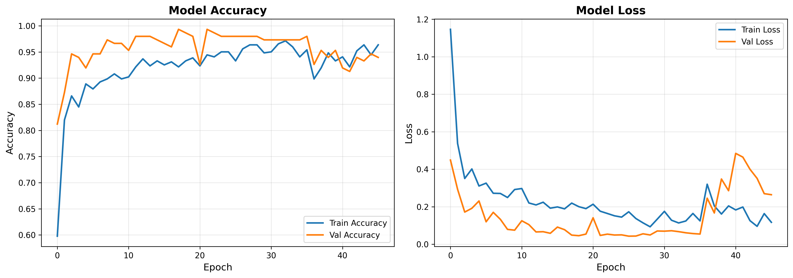
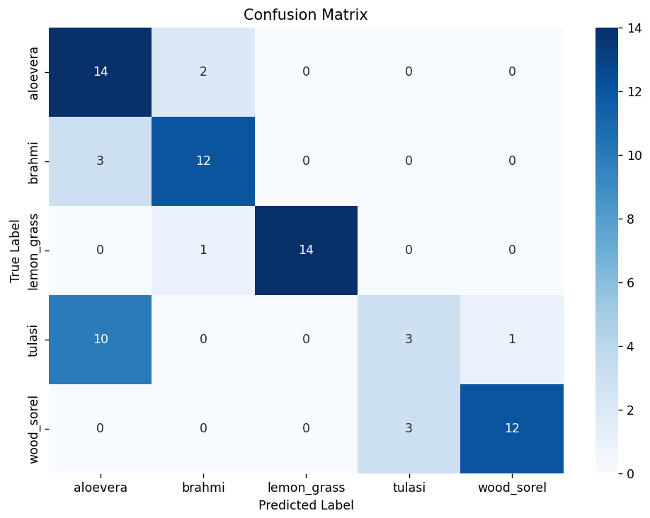
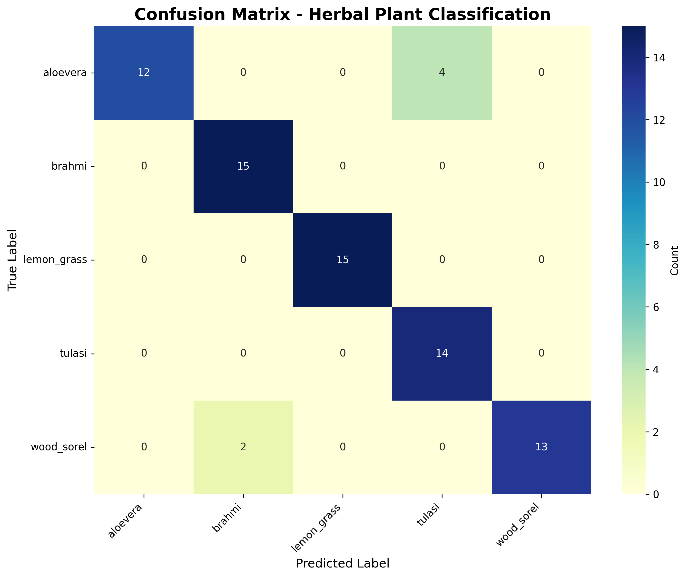

# 🌿 AI Herbal Plant Identifier


## 📖 Executive Summary
The **AI Herbal Plant Identifier** is an end-to-end Deep Learning solution designed to classify medicinal plant species from raw images. The project demonstrates a clear evolution from a baseline custom CNN architecture (**V1**) to a production-grade Transfer Learning pipeline (**V2**) deployed via a Flask REST API.

### 🍃 Supported Species
The model is trained to distinguish between the following five medicinal classes:
1. **Aloe Vera**
2. **Brahmi**
3. **Lemon Grass**
4. **Tulasi** (Holy Basil)
5. **Wood Sorel**

---

## 🎯 Key Features

- 📸 **Real-time Image Classification** - Upload and classify plant images instantly
- 🧠 **Transfer Learning** - Leverages MobileNetV2 pre-trained on ImageNet
- 📊 **High Accuracy** - Achieves ~96% classification accuracy
- 🌐 **Web Interface** - User-friendly Flask-based web application
- 🔄 **Data Augmentation** - Robust training with image transformations
- 📈 **Performance Tracking** - Comprehensive metrics and visualizations

---

## 🏗️ Project Architecture & Evolution

### 🔹 Version 1: Baseline Custom CNN (`v1-basic-cnn`)
**Objective:** Establish a performance baseline using a custom architecture trained from scratch.

- **Architecture:** A sequential model consisting of 4 Convolutional blocks (Conv2D + MaxPooling), followed by Flatten and Dense layers with Dropout for regularization.
- **Outcome:** Achieved moderate accuracy (~73%). The model exhibited signs of overfitting due to the limited dataset size and lack of complex feature extraction capabilities.
- **Artifacts:** Model saved as legacy `.h5` format.

### 🔹 Version 2: Production-Grade Transfer Learning (`v2-improved`)
**Objective:** Maximize accuracy and deploy as a user-friendly web application.

- **Architecture:** Utilized **MobileNetV2** (pre-trained on ImageNet) as the feature extractor.
- **Methodology:** 
  - Implemented **Data Augmentation** (Rotation, Zoom, Shear, Brightness) to improve generalization.
  - Applied **Fine-Tuning** by unfreezing top layers of the base model.
  - Integrated **ModelCheckpoint** and **EarlyStopping** callbacks.
- **Outcome:** Accuracy improved significantly to **~96%**.
- **Deployment:** Wrapped the model in a **Flask API** with a responsive HTML5 frontend for real-time inference.
- **Artifacts:** Model saved as modern `.keras` format.

---

## 📊 Performance Metrics

### 1. Training History
The graphs below illustrate the learning curves. Notice the stability and higher convergence in V2 compared to V1.

| **V1: Custom CNN** | **V2: Transfer Learning** |
|:---:|:---:|
|  |  |
| *High variance validation loss* | *Smoother convergence & higher accuracy* |

### 2. Confusion Matrices
The confusion matrix highlights the model's ability to distinguish between similar-looking leaves (e.g., distinguishing *Lemon Grass* from *Aloe Vera*).

| **V1 Confusion Matrix** | **V2 Confusion Matrix** |
|:---:|:---:|
|  |  |

---

## 🚀 Installation & Setup

### Prerequisites
- Python 3.8 or higher
- pip package manager
- Virtual environment (recommended)

### 1. Clone the Repository
Open your terminal and clone the project to your local machine:
```bash
git clone https://github.com/YOUR_USERNAME/AI-Herbal-Identifier.git
cd AI-Herbal-Identifier
```

### 2. Environment Setup
It is recommended to use a virtual environment to manage dependencies.
```bash
# Create a virtual environment (optional but recommended)
python -m venv venv

# Activate the virtual environment
# On Windows:
venv\Scripts\activate
# On macOS/Linux:
source venv/bin/activate

# Install dependencies using the provided requirements file
pip install -r requirements.txt
```

### 3. Running the Web Application (V2)
To launch the improved classification interface (Backend + Frontend):
```bash
# Navigate to the Version 2 directory
cd v2-improved

# Start the Flask Server
python app.py
```

The server will initialize and display:
```
* Running on http://localhost:5000
```

Open your browser and navigate to: **http://localhost:5000**

Upload an image to see the prediction and confidence score.

### 4. Retraining the Model
If you wish to retrain the model with your own dataset:

1. **Prepare your dataset** - Organize images into the following structure:
```
   dataset/
   ├── train/
   │   ├── aloe_vera/
   │   ├── brahmi/
   │   ├── lemon_grass/
   │   ├── tulasi/
   │   └── wood_sorel/
   ├── validation/
   │   └── [same structure]
   └── test/
       └── [same structure]
```

2. **Update the dataset path** in `classification.py` if needed

3. **Run the training script:**
```bash
   cd v2-improved
   python classification.py
```

---

## 🧪 API Testing

The project includes a testing script to verify the backend logic programmatically without using the browser.
```bash
cd v2-improved
python test_api.py
```

This script performs:
- Health checks
- Batch predictions
- Error handling verification

---

## 📂 Repository Structure
```text
AI-HERBAL-IDENTIFIER/
│
├── v1-basic-cnn/                  # Phase 1: Baseline Experiment
│   ├── model/                     # Saved legacy models
│   │   └── herbal_plant_classifier.h5
│   ├── results/                   # Visualization metrics
│   │   ├── confusion_matrix.png
│   │   └── model_accuracy vs loss.png
│   └── classification.py          # V1 Training script
│
├── v2-improved/                   # Phase 2: Production Solution
│   ├── models/                    # Optimized .keras models
│   │   ├── best_herbal_classifier.keras
│   │   └── herbal_plant_classifier_final.keras
│   ├── results/                   # Visualization metrics
│   │   ├── confusion_matrix.png
│   │   └── training_history.png
│   ├── app.py                     # Flask Backend Application
│   ├── classification.py          # V2 Training script (MobileNetV2)
│   ├── index.html                 # Frontend User Interface
│   └── test_api.py                # Automated API testing script
│
├── LICENSE                        # MIT License
├── requirements.txt               # Project dependencies
└── README.md                      # Documentation
```

---

## 🛠️ Technology Stack

- **Deep Learning Framework:** TensorFlow/Keras
- **Base Model:** MobileNetV2 (Transfer Learning)
- **Web Framework:** Flask
- **Frontend:** HTML5, CSS3, JavaScript
- **Image Processing:** PIL/Pillow, OpenCV
- **Visualization:** Matplotlib, Seaborn
- **Data Manipulation:** NumPy, Pandas

---

## 📈 Model Performance Comparison

| Metric | V1 (Custom CNN) | V2 (Transfer Learning) |
|--------|----------------|----------------------|
| **Accuracy** | ~73% | ~96% |
| **Training Time** | Slower | Faster (pre-trained weights) |
| **Overfitting** | High | Minimal (data augmentation) |
| **Model Size** | Medium | Optimized |
| **Deployment Ready** | No | Yes |

---

## 🔮 Future Enhancements

- [ ] Expand to 20+ medicinal plant species
- [ ] Mobile application (Android/iOS)
- [ ] Real-time camera classification
- [ ] Add medicinal properties information for each plant
- [ ] Deploy to cloud platform (AWS/GCP/Azure)
- [ ] Implement user authentication
- [ ] Add multi-language support
- [ ] Create batch processing API endpoint

---

## 🤝 Contributing

Contributions are welcome! Please feel free to submit a Pull Request. For major changes:

1. Fork the repository
2. Create your feature branch (`git checkout -b feature/AmazingFeature`)
3. Commit your changes (`git commit -m 'Add some AmazingFeature'`)
4. Push to the branch (`git push origin feature/AmazingFeature`)
5. Open a Pull Request

---


